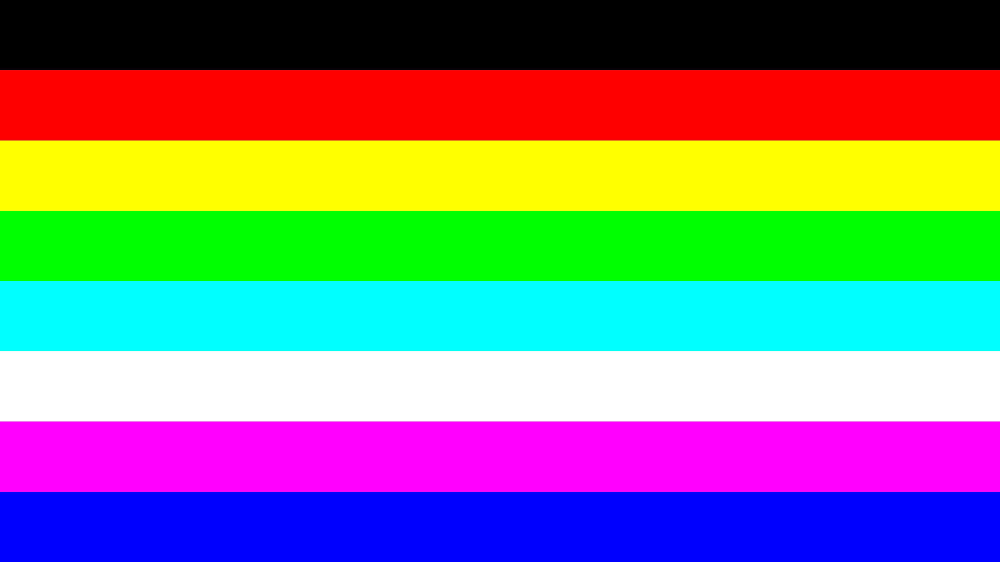

# ooo-repositoriolle



Create picture with evenly spaced different coloured horizontal bands for monitor color matching. The number of bands is SHADES_PER_COLOR^3 (2^3=8 on default) and height of each band is about HEIGHT/NUMBER_OF_BANDS (2160/8=270 on default).

```console
git clone git@github.com:JoakimJoensuu/ooo-repositoriolle.git
cd ooo-repositoriolle
python3 -m venv env
source env/bin/activate
pip install -r requirements.txt
python .
```